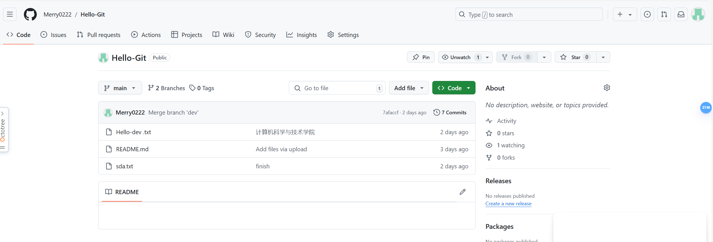
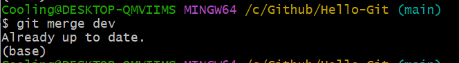

# 前言
---------
由于我刚开始学习过程整理的不是很具体详尽，于是我决定从头重新开始，因此有一些截图可能对应不上
# 正文 #
## 一.git
  1. git的配置
  
  1. github的连接和文件互通
  
       * 分支截图
  1. 合并分支冲突和解决
      * 合并冲突
      * 冲突原因：同文件内容不同
      * 解决冲突
  2. 解决问题
  3. github pages
  * 踩坑：
     1. 没修改分支为main
     2. 干等不刷新
## 二.markdown
  1. 使用场景：工作记录
  2. 重写开源项目的README.md
  3. LeNet5搭建
  ###  开局就是蛋疼的就来了
我们首先来到深度学习环境的配置，网上能找到的教程基本都是anacanda加pycharm  
那先不管别的，直接照着教程动手做吧。  
    
可以看到也是成功加载pytorch环境了
    
然而在试图在pychaem中借由anaconda安装pytorch的时候，不知道是版本问题还是我python安装的位置问题  
    
#### 始终找不到路径
  大概研究了一个多点，无奈求助先锋学长
#### 然后一下就成了。。。  
  从安装配置anaconda开始算，到这时已经用了数个小时
  #  完  全  失  败 #
  ###   *转向vscode然后10分钟配置完了环境*
我真服了  
行吧，好歹能用了  
   * 接着就是学习lenet5基本结构和原理
     * #### 在b站随便找了一个网课简单听他解释了各个层的原理以及作用（PS：这网课有些年头了但是能听）
     
  ### 很好，大概懂了
  找了个用MINIST训练的lenet5模型复制下来
  ### 然而接下来更蛋疼的来了
  ### xdx根本不懂python哈哈哈哈
* 那只能硬着头皮看代码了，走一步查一步。  
* 好在这个教程给的代码注释很完整，加上xdx也算对lenet5有基本的了解，再加上我们伟大的ai工具，整个过程倒是蛮顺利  
    xdx用的最多的就数微软的copilot
    不得不感叹，时代在进步，现在这种ai工具真是太方便了  
经过一番调试，也是成功跑起来了  
   
  * ### 这是训练10轮跑出来的   
     
     
  * ### 这是训练50轮跑出来的   
        
  ### 可以看到 *准确率确实有较明显的上升*
  #### 接下来看看代码
首先引入库

        import torch
        import torch.nn as nn
        import torchvision
        import torchvision.transforms as transforms
选择使用GPU进行训练 

        device = torch.device("cuda")
数据预处理

    transform = transforms.Compose([
        transforms.RandomHorizontalFlip(),    #随机排序
        transforms.RandomCrop(32, padding=4), #加padding然后裁剪成32*32
        transforms.ToTensor(),  #将数据转化为pythorch张量，然后将像素值标准化
        transforms.Normalize((0.5, 0.5, 0.5), (0.5, 0.5, 0.5))    #RGB标准化
    ])

加载训练集

      train_dataset = torchvision.datasets.CIFAR10(root='./data',  # 数据集保存路径
                                             train=True,      # 是否为训练集
                                             transform=transform,  # 数据预处理
                                             download=True)   # 是否下载

加载测试集

      test_dataset = torchvision.datasets.CIFAR10(root='./data',
                                            train=False,
                                            transform=transform,
                                            download=True)
为了方便，定义了一个变量来改变单次训练量

        batch_size = 2

加载训练数据

        train_loader = torch.utils.data.DataLoader(dataset=train_dataset,
                                           batch_size=batch_size,
                                           shuffle=True)  # 是否打乱

加载测试数据

        test_loader = torch.utils.data.DataLoader(dataset=test_dataset,
                                          batch_size=batch_size,
                                          shuffle=False)  # 是否打乱

ok,咱们前置任务就算做完了  
接下来就是写个标准的lenet5模型

        #定义名为LeNet5的神经网络模型类，并初始化它的基本结构
        class LeNet5(nn.Module):
            def __init__(self, num_classes):
                super(LeNet5, self).__init__()
                # 卷积层 1
                self.layer1 = nn.Sequential(
                    nn.Conv2d(3, 6, kernel_size=5, stride=1, padding=0),	# 卷积
                    nn.BatchNorm2d(6),		# 归一化
                    nn.ReLU(),)
                # 下采样
                self.subsampel1 = nn.MaxPool2d(kernel_size = 2, stride = 2)		# 最大池化(pooling)
                # 卷积层 2
                self.layer2 = nn.Sequential(
                    nn.Conv2d(6, 16, kernel_size=5, stride=1, padding=0),
                    nn.BatchNorm2d(16),
                    nn.ReLU(),)
                # 下采样
                self.subsampel2 = nn.MaxPool2d(kernel_size = 2, stride = 2) #(pooling)
                # 全连接
                self.L1 = nn.Linear(400, 120)
                self.relu = nn.ReLU()
                self.L2 = nn.Linear(120, 84)
                self.relu1 = nn.ReLU()
                self.L3 = nn.Linear(84, num_classes)
            # 前向传播(前面是对卷积，池化层和全连接层的编写，接下来是调用他们的时候了)
            def forward(self, x):
                out = self.layer1(x)
                out = self.subsampel1(out)
                out = self.layer2(out)
                out = self.subsampel2(out)
                # 将上一步输出的像素展平成一维向量，以便下一步全连接（全连接只能输入一维数据，故需要展平操作）
                out = out.reshape(out.size(0), -1)
                # 全连接
                out = self.L1(out)
                out = self.relu(out)
                out = self.L2(out)
                out = self.relu1(out)
                out = self.L3(out)
                return out

因为CIFAR10一共有10种数据类型,所以我们定义一个输出的类型数,赋值10

        num_classes = 10
创建LeNet5模型

        model = LeNet5(num_classes).to(device)
引入计算损失的函数

        cost = nn.CrossEntropyLoss()
设置学习率,加载优化器

        learning_rate = 0.001#能用就行，所以固定学习率
        optimizer = torch.optim.Adam(model.parameters(), lr=learning_rate)#优化器
        total_step = len(train_loader)
设置一共训练几轮

        num_epochs = 10
然后就是进行训练了

        # 外部循环用于遍历轮次
        for epoch in range(num_epochs):
            # 内部循环用于遍历每轮中的所有批次
           for i, (images, labels) in enumerate(train_loader):  
               images = images.to(device)
               labels = labels.to(device)

               # 前向传播
               outputs = model(images)   # 通过模型进行前向传播，得到模型的预测结果 outputs
               loss = cost(outputs, labels)	# 计算模型预测与真实标签之间的损失

               # 反向传播和优化
               optimizer.zero_grad()	# 清零梯度，以便在下一次反向传播中不累积之前的梯度
               loss.backward()		# 进行反向传播，计算梯度
               optimizer.step()	# 根据梯度更新（优化）模型参数

               # 定期输出训练信息
               # 在每经过一定数量的批次后，输出当前训练轮次、总周轮数、当前批次、总批次数和损失值
                if (i+1) % 400 == 0:
                    print ('Epoch [{}/{}], Step [{}/{}], Loss: {:.4f}' 
                		           .format(epoch+1, num_epochs, i+1, total_step, loss.item()))
        with torch.no_grad():	# 指示 PyTorch 在接下来的代码块中不要计算梯度
            # 初始化计数器
            correct = 0		# 正确分类的样本数
          total = 0		# 总样本数

            # 遍历测试数据集的每个批次
            for images, labels in test_loader:
                # 将加载的图像和标签移动到设备（通常是 GPU）上
                images = images.to(device)
                labels = labels.to(device)

               # 模型预测
               outputs = model(images)
最后就是检验训练成果的时候了  
*计算准确率*

                # 从模型输出中获取每个样本预测的类别
                _, predicted = torch.max(outputs.data, 1)
                # 累积总样本数
                total += labels.size(0)
                # 累积正确分类的样本数
                correct += (predicted == labels).sum().item()
*输出准确率*(正确样本数/总样本数,再表示为百分比形式)

            print('Accuracy of the network on the 10000 test images: {} %'.format(100 * correct / total))
  ### ok,成了
## 三.Linux与shell
### 现在时间：9月19日晚22：49  没时间废话了直接看脚本吧
#### test1.sh代码  

#### test1.sh运行结果  

#### 输出文件  

## xdx还要填表，背四级词汇，题就先做到这了
## 零基础走到这一步说实话感觉进不了先锋也值了
# 困困困困困